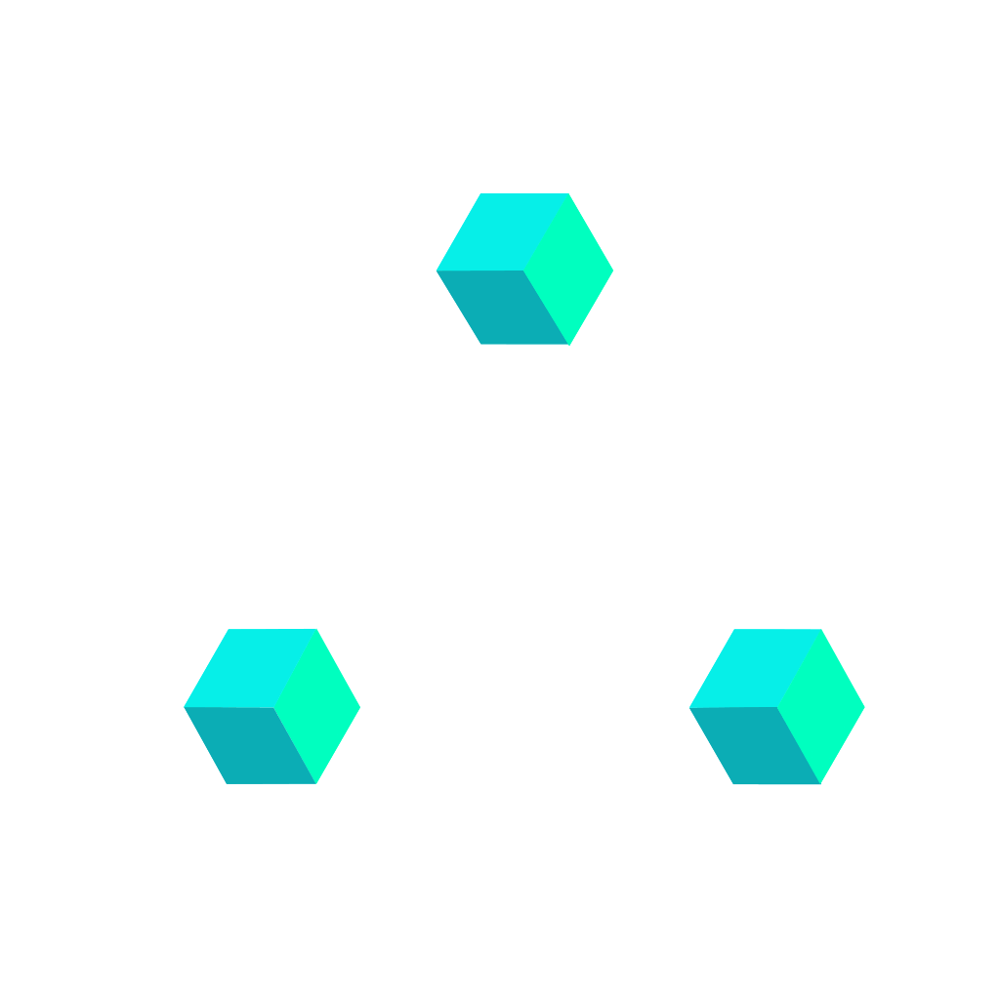

# AMACA DESIGN SYSTEM — `design.md`

> **Version** 2.7.2 — 2026.06.12
> **Author** Angelo Macaione
> **Audience** AI coding assistants (Cursor, Copilot, Claude Code, Cline, Aider, Continue) and humans pairing with them inside an IDE.
> **Purpose** Single-file context. Paste the whole document into the model's system prompt, project rules file (`.cursor/rules`, `CLAUDE.md`, `.continuerules`, `.windsurfrules`), or repo root. Every output the model produces against this system should sound, look, and behave like the rest of the work.

---

## 0. How to use this file

This is a **specification + a contract**. Treat it as canonical. When code or output disagrees with this file, this file wins.

### 0.1 For the AI agent

When you generate UI code, you must:

1. **Use only the tokens in § 2.** Never invent a hex value, never use a raw `px` for spacing if a token covers it, never write a `cubic-bezier(...)` letterally if one of the four named easings already matches. If the value you need isn't in the scale, **stop and ask** — don't extend the system silently.
2. **Reference tokens by CSS variable name** (`var(--magenta-500)`, `var(--s-6)`, `var(--ease-decel)`). Hardcoded literals in component code are a regression.
3. **Match the seven principles in § 1.** If the user asks for something that violates a principle, surface the conflict and propose a compliant alternative before writing code.
4. **Write canonical HTML.** Close every non-void element explicitly. Double-quote every attribute. No implied closes (write `<p>…</p>`).
5. **Don't add filler.** No placeholder copy, no decorative icons, no unrequested sections. One thousand no's for every yes.
6. **Don't decorate with motion.** Motion is feedback (§ 1.5, § 8). If an animation doesn't communicate state change, it doesn't ship.
7. **Always honor `prefers-reduced-motion: reduce`.** Every transition you add needs a media-query fallback.
8. **Show your work.** When you make a non-obvious choice (which token, which variant, why), say it in a one-line comment above the affected line. Brevity over prose.

### 0.2 For the human

Keep this file at repo root. Update the version line on every breaking change. The system is dark-first, dark-only at v1.x — light-mode resolution is planned for v2.

---

## 1. Principles · five rules, exceptions earn their keep

Every output is graded against these. Cite the number when explaining a tradeoff.

### 1.1 Clarity before cleverness
The obvious answer, on purpose. If the user has to decode an icon or guess at a label, we failed. Metaphors earn their keep or get cut.

**For agents:** prefer a labeled button over an icon-only button. Prefer a verbose variable name over a clever one. Prefer 4 lines of explicit code over 1 line of trick.

### 1.2 Evidence over opinion
Every decision shows its work. The dead end is part of the file too. When you make a choice, leave a trace — a comment, a token reference, a link to the spec.

**For agents:** when the user asks "why," answer with the principle number, the token reference, or the prior commit. Never "because it looks better."

### 1.3 Precision is a feeling
Rigor the eye picks up before the mind does. Spacing on a 4px grid. Type on the scale. Motion on the curve. When they're locked, the work reads as considered before a word is parsed.

**For agents:** never use values that aren't on a scale. `padding: 14px` is wrong; `padding: var(--s-3) var(--s-4)` is right.

### 1.4 Quiet, then loud
Restraint is what makes accents land. Most of the surface stays neutral. Color, motion, weight — they only show up where the work needs them.

**For agents:** the **85 / 10 / 5** law. 85% of any surface is `--obsidian-*`. ~10% is supporting (cyan, petrol, semantic). ≤5% is `--magenta-*`. If you're using magenta on more than one element per viewport, you're decorating.

### 1.5 Motion is a material
Interfaces are not static. The way something arrives, settles, responds carries meaning. Every entrance breathes on the same curve — `cubic-bezier(0.16, 1, 0.3, 1)`, the signature ease, living at `--ease-decel` since v2.0.0 — so the whole document feels like one instrument.

**For agents:** motion communicates state change (entering, exiting, focus, error). Motion that doesn't communicate gets cut.

---

## 2. Tokens · the only acceptable values

All tokens live in `styles/tokens.css` and are exposed as CSS custom properties. **Reference by name, never copy the value.**

### 2.1 Color · neutrals (Obsidian scale)

| Token | Hex | Use |
|---|---|---|
| `--obsidian-950` | `#07090B` | Page background |
| `--obsidian-900` | `#0B0E12` | Surface |
| `--obsidian-850` | `#10141A` | Elevated surface |
| `--obsidian-800` | `#161B22` | Card |
| `--obsidian-700` | `#1E242D` | Border strong |
| `--obsidian-600` | `#2A313B` | Border |
| `--obsidian-500` | `#3A4451` | Muted edge |
| `--obsidian-400` | `#5B6573` | Disabled text |
| `--obsidian-300` | `#8A94A3` | Secondary text |
| `--obsidian-200` | `#B8C0CB` | Tertiary text |
| `--obsidian-100` | `#E3E7EC` | **Primary text on dark** |
| `--obsidian-050` | `#F4F6F8` | Bone (max contrast) |

### 2.2 Color · brand (Magenta primary)

| Token | Hex | Use |
|---|---|---|
| `--magenta-100` | `#FFE3F8` | Tints, soft highlights |
| `--magenta-200` | `#FFB5EC` | |
| `--magenta-300` | `#FF85DF` | Hover state on magenta links |
| `--magenta-400` | `#F868D8` | Links on dark, mono accents |
| `--magenta-500` | `#F051D5` | **Primary brand · CTAs · focus rings** |
| `--magenta-600` | `#C93BB0` | Pressed state |
| `--magenta-700` | `#9A2D87` | Deep brand accents |
| `--magenta-800` | `#66195A` | Reserved |

### 2.3 Color · supporting

| Token | Hex | Role |
|---|---|---|
| `--secondary-400` | `#00FFF2` | Electric cyan (rare; data viz only) |
| `--tertiary-500` | `#0C6078` | Petrol teal (deep dive accents) |
| `--success` | `#3AFFC7` | Confirmation only |
| `--warning` | `#F6C65B` | Caution only |
| `--danger` | `#FF5B5B` | Error / destructive only |
| `--info` | `#5CC8FF` | Inline info, links in long-form |

**The 85/10/5 law:** ~85% of any surface uses `--obsidian-*`. ~10% supporting/semantic. ≤5% `--magenta-*`. Violations are visible at a glance.

### 2.4 Type

Single typeface — **Satoshi** — across the whole system. `--font-sans` resolves to Satoshi; the system uses a generic monospace stack (`ui-monospace, SFMono-Regular, Menlo, monospace`) only for tabular numerics and code captions.

| Token | Size | Typical use |
|---|---|---|
| `--t-display` | `112px` | Marketing hero only |
| `--t-h1` | `76px` | Page title (one per page) |
| `--t-h2` | `52px` | Section title |
| `--t-h3` | `38px` | Subsection title |
| `--t-h4` | `30px` | Card title |
| `--t-h5` | `24px` | Small heading |
| `--t-h6` | `20px` | Eyebrow heading |
| `--t-lead` | `18px` | Page lede / intro paragraph |
| `--t-body` | `15px` | **Default body text** |
| `--t-small` | `13px` | Captions, table cells |
| `--t-caption` | `12px` | Smallest readable text |
| `--t-micro` | `10px` | Mono labels, eyebrows, kbd keys |

| Line height | Value | Use |
|---|---|---|
| `--lh-tight` | `1.05` | Display text |
| `--lh-snug` | `1.2` | Headings |
| `--lh-normal` | `1.45` | UI text |
| `--lh-loose` | `1.65` | Running body copy |

| Tracking | Value | Use |
|---|---|---|
| `--tr-tight` | `-0.04em` | Display |
| `--tr-snug` | `-0.02em` | Headings |
| `--tr-normal` | `0` | Body |
| `--tr-wide` | `0.04em` | Small caps |
| `--tr-mono` | `0.06em` | All-caps mono labels |

**Rules:**
- One H1 per page. Always.
- Mono labels: 10px, uppercase, `--tr-mono`, `--magenta-400` for brand context or `--obsidian-400` for neutral.
- Never use a font-size outside this scale. If the eye demands an in-between value, the issue is the surrounding hierarchy — fix that.

### 2.5 Spacing — 4px grid

| Token | Px | Common use |
|---|---|---|
| `--s-0` | `0` | |
| `--s-1` | `4` | Hairline gap (icon ↔ text) |
| `--s-2` | `8` | Tight pair |
| `--s-3` | `12` | Inline gap |
| `--s-4` | `16` | Default content gap |
| `--s-5` | `20` | Compact section gap |
| `--s-6` | `24` | Card padding · subsection rhythm |
| `--s-8` | `32` | Card padding (generous) |
| `--s-10` | `40` | Block separator |
| `--s-12` | `48` | Section margin |
| `--s-16` | `64` | Major section break |
| `--s-20` | `80` | Page-level rhythm |
| `--s-24` | `96` | Hero spacing |
| `--s-32` | `128` | Long-form vertical breathing |

**Rule:** every margin, padding, gap is a token. No `13px`, no `20px;` literals in component CSS.

### 2.6 Radius

| Token | Px | Use |
|---|---|---|
| `--r-none` | `0` | Tables, dense data |
| `--r-xs` | `2` | Code chips |
| `--r-sm` | `4` | Tags, kbd keys |
| `--r-md` | `8` | **Default — buttons, inputs, small cards** |
| `--r-lg` | `12` | **Large cards, panels** |
| `--r-xl` | `16` | Modal, drawer |
| `--r-2xl` | `24` | Hero block |
| `--r-full` | `999px` | Pills, status dots |

**Working range is 8–12px.** If a component asks for more, justify it.

### 2.7 Shadow

| Token | Use |
|---|---|
| `--sh-1` | Resting card |
| `--sh-2` | Hover lift |
| `--sh-3` | Floating panel |
| `--sh-4` | Modal / drawer |
| `--sh-glow` | Focus state on brand elements |
| `--sh-glow-soft` | Ambient brand glow (rare) |

Shadows are inset-first, low-key. Never use them as decoration — only for depth hierarchy.

### 2.8 Motion

**Six durations, four easings. No others.**

| Duration | ms | Use |
|---|---|---|
| `--d-instant` | `100` | Hover state, tap feedback |
| `--d-quick` | `200` | Button states, focus rings |
| `--d-base` | `350` | Default — most UI transitions |
| `--d-slow` | `600` | Page enters, panel slides |
| `--d-scene` | `900` | Hero reveals, orchestrated sequences |
| `--d-draw` | `1200` | Data draw-on: chart tracing, count-up, progressive data reveals |

| Easing | Curve | Use |
|---|---|---|
| `--ease-standard` | `cubic-bezier(0.22, 1, 0.36, 1)` | Default UI ease-out (Framer ease) |
| `--ease-accel` | `cubic-bezier(0.7, 0, 0.84, 0)` | Exits, dismissals |
| `--ease-decel` | `cubic-bezier(0.16, 1, 0.3, 1)` | Entrances, reveals (the system signature) |
| `--ease-spring` | `cubic-bezier(0.34, 1.56, 0.64, 1)` | Pop-in, delight, overshoot |

**Default pairing:** `transition: <prop> var(--d-quick) var(--ease-standard)` for UI states. Switch to `--d-base var(--ease-decel)` for content reveals.

**Reduced motion is mandatory** — and the CSS kill-switch alone is not enough: JS-driven animation (Motion One / WAAPI, counters writing `textContent`) bypasses CSS. Gate it in JS — read `matchMedia('(prefers-reduced-motion: reduce)')` and jump to the final state (v2.7.0: the shared `window.__motion` gate does this for every `animate()` call).

**CSS kill-switch:**
```css
@media (prefers-reduced-motion: reduce){
  *, *::before, *::after{
    animation-duration: 0.01ms !important;
    transition-duration: 0.01ms !important;
  }
}
```
Every component with hover transforms, fade-ins, or orchestrated animation must also override its specific transitions to `none` inside this query.

### 2.9 Layout

| Token | Value | Use |
|---|---|---|
| `--sidebar-w` | `260px` | Sidebar nav width |
| `--content-max` | `1180px` | Max content width |
| `--gutter` | `24px` | Column gutter |

12-col grid. Sidebar is fixed; content breathes.

---

## 3. Components · canonical specs

Every component below maps 1:1 to a class in `styles/components.css`. **Reuse classes; don't reinvent components.**

### 3.1 Button

```html
<button class="btn btn-primary">Primary</button>
<button class="btn btn-ghost">Ghost</button>
<button class="btn btn-secondary">Secondary</button>
<button class="btn btn-danger">Destructive</button>
```

| Variant | Background | Text | Use |
|---|---|---|---|
| `.btn-primary` | `--magenta-500` | `--obsidian-050` | One per screen — the affirmative action |
| `.btn-secondary` | `--obsidian-800` | `--obsidian-100` | Neutral action |
| `.btn-ghost` | transparent | `--obsidian-100` | Tertiary — sits inside cards |
| `.btn-danger` | `--danger` | dark | Destructive only |

**Rules:**
- One `.btn-primary` per screen. Everything else recedes.
- Sizes: `.btn-sm` (compact), default (32px), `.btn-lg` (44px touch target).
- Focus: dual-ring (white outline + magenta halo). Never remove `outline` without re-implementing focus visibility.
- Primary label is near-white (`--obsidian-050`) on `--magenta-500` — a ratified exception to the § 6 floor (§ 6.3, ≈ 2.8 : 1), kept on perceptual grounds. Scoped to `.btn-primary`; rest and hover are bounded to `--magenta-500` (no lighten). Never use a light label on magenta elsewhere.
- **Label weight is Medium 500 — ratified 2026-06-12** after a 400 / 500 / 700 comparison. Under APCA stroke weight is a contrast input and 700 scores strongest, but at 15px the bold label shifts the button's voice; 500 keeps the register, and the legibility budget is carried by the § 6.3 pairing. Don't bold the primary label for emphasis; don't drop below 500.

### 3.2 Input · textarea · select

```html
<label class="field">
  <span class="field-label">EMAIL</span>
  <input class="input" type="email" placeholder="you@studio">
</label>
```

- Labels are mono-uppercase, `--t-micro`, `--obsidian-400`. Always persistent — placeholder is **not** a label.
- Focus state: border shifts to `--magenta-500` + `0 0 0 3px rgba(240,81,213,0.15)` glow.
- Error state: border `--danger`, helper text below in `--danger`.

### 3.3 Card

```html
<div class="card">
  <div class="card-meta">PROJ-014 · 2025.10</div>
  <h3>Card title</h3>
  <p>Body…</p>
</div>
```

- Background: `--obsidian-800`. Border: `1px solid --obsidian-700`. Radius: `--r-lg`.
- Every card carries a micro-header (`.card-meta`) with project code, date, or index. Mono, `--t-micro`, `--obsidian-400`.
- Hover: border shifts to `--obsidian-600`, shadow `--sh-2`. Transition: `var(--d-quick) var(--ease-standard)`.

### 3.4 Badge

```html
<span class="badge badge-live"><span class="dot"></span> Live</span>
<span class="badge badge-draft">Draft</span>
```

- Always Satoshi, always paired with a dot when live.
- Size: `--t-micro`, uppercase, `--tr-mono`.
- Colors: `--success` (live), `--warning` (draft), `--danger` (broken), `--obsidian-400` (archived).

### 3.5 Navigation

- **Sidebar nav** for documentation. Items use `.nav-item`. Active state: text `--obsidian-100` + magenta indicator bar (single shared `.nav-indicator` per group, animated via `transform: translateY()`).
- **Top nav** for marketing only.
- **Breadcrumb** in mono, `--t-micro`, separators in `--obsidian-500`.

### 3.6 Accordion

- Single-open by default.
- Chevron rotates 90° on expand (`transform var(--d-base) var(--ease-decel)`).
- Keyboard-operable: `aria-expanded` toggled, `Enter`/`Space` opens/closes.
- `prefers-reduced-motion`: instant swap, no chevron rotate.

### 3.7 Tabs

```html
<div class="tabs" role="tablist" data-tabs>
  <button class="tab active" role="tab" aria-selected="true" data-panel="p1">First</button>
  <button class="tab" role="tab" aria-selected="false" data-panel="p2">Second</button>
  <span class="tab-indicator" aria-hidden="true"></span>
</div>
<div class="tab-panels">
  <div class="tab-panel active is-in" id="p1" role="tabpanel">…</div>
  <div class="tab-panel" id="p2" role="tabpanel">…</div>
</div>
```

**Required classes:**
- `.tabs` — wrapper, `position:relative`, bottom border 1px `--obsidian-800`.
- `.tab` — trigger button. `.active` sets weight 600 + text `--obsidian-100`.
- `.tab-indicator` — single magenta underline, `position:absolute; bottom:-1px; height:2px; width:0`. Positioned by JS via `transform: translateX(...)` + `width`.
- `.tab-panels` / `.tab-panel` — panels hidden via `display:none`; `.active` reveals; `.is-in` fades in.

**Indicator positioning (canonical JS pattern):**
```javascript
function moveIndicator(tab){
  const rect = tab.getBoundingClientRect();
  const parentRect = tablist.getBoundingClientRect();
  indicator.style.width = rect.width + 'px';
  indicator.style.transform = 'translateX(' + (rect.left - parentRect.left) + 'px)';
}
```
Duration `var(--d-base)` with `var(--ease-decel)` on both `transform` and `width`. Use `will-change: transform, width`.

**Initial position:** double `requestAnimationFrame` so layout is measured after first paint. Re-measure on `window.resize`, and also when the parent section becomes visible (the tablist may live inside a hidden `.section` on first paint and `getBoundingClientRect` returns zeros). An `IntersectionObserver` at threshold 0.01 covers that case.

**Panel transitions:** default `opacity:0; transform:translateY(6px)` → `.is-in` adds `opacity:1; transform:translateY(0)`. Duration `var(--d-quick)` with `var(--ease-standard)`.

**Rules:**
- Panel swap is **fade only**: never crossfade, never slide both. The leaving panel is removed (`display:none`) before the new one fades in.
- `prefers-reduced-motion: reduce` — `.tab-indicator` transition becomes `none`; panels swap instantly.
- Keyboard: `Tab` reaches each trigger; `Enter`/`Space` activates.

### 3.8 Lightbox

- Backdrop: `rgba(0,0,0,0.85)`.
- Close button: top-right, `Esc` closes.
- Transition: opacity `var(--d-quick) var(--ease-standard)`. No scale-in.

### 3.9 Time input

```html
<label class="field">
  <span class="field-label">ORARIO</span>
  <input class="input" type="text" id="time-input"
    placeholder="es. 18:00"
    autocomplete="off"
    maxlength="5"
    inputmode="numeric" />
</label>
```

Formato HH:MM, 24h. Auto-formatta mentre si digita.

**Regole di validazione digit per digit:**
- Cifra 1 (H1): max `2`
- Cifra 2 (H2): max `3` se H1 = `2`, altrimenti `0–9`
- Cifra 3 (M1): max `5`
- Cifra 4 (M2): `0–9`

Il `:` viene inserito automaticamente dopo le prime due cifre. L'utente digita solo numeri.

```javascript
document.getElementById("time-input").addEventListener("input", function () {
  let raw = this.value.replace(/\D/g, "");
  let out = "";
  for (let i = 0; i < Math.min(raw.length, 4); i++) {
    let d = parseInt(raw[i]);
    if (i === 0) d = Math.min(d, 2);
    if (i === 1 && out[0] === "2") d = Math.min(d, 3);
    if (i === 2) d = Math.min(d, 5);
    out += d;
  }
  this.value = out.length >= 3 ? out.slice(0, 2) + ":" + out.slice(2) : out;
});
```

**Regole:**
- `maxlength="5"` e `inputmode="numeric"` sono obbligatori.
- Opzionale di default; può essere reso obbligatorio per contesto specifico.
- Nessun `type="time"` — il native picker non rispetta il design system.
- Focus e stato di errore seguono § 3.2.

### 3.10 Dropdown / Select

Two variants. Pick the smallest that covers the requirement.

#### A. Native enhanced — `<select class="select">`

Default choice. Use when options are fixed, short, no custom rendering required. Inherits browser keyboard nav, mobile UI, accessibility for free.

```html
<select class="select">
  <option>Draft</option>
  <option>Pending</option>
  <option>Published</option>
</select>
```

**Style contract:**
- `appearance: none; -webkit-appearance: none; -moz-appearance: none`
- Background: inline SVG chevron (down) as `background-image`, **canonical stroke `%238A94A3`**, 12×12 viewBox, `stroke-width:2.5`. Positioned `right 12px center`, size `12px 12px`.
- `padding-right: 36px` to reserve space for the chevron.
- Same border / radius / focus glow as `.input` (§ 3.2).

#### B. Custom listbox

Reach for this only when native can't carry the requirement: search/filter inside menu, multi-select with chips, custom option rendering (avatars, badges, two-line items), grouped headings beyond `<optgroup>`.

```html
<div class="select-wrap" data-select>
  <button type="button" class="select select-trigger"
    aria-haspopup="listbox" aria-expanded="false" aria-labelledby="status-label">
    <span class="select-value">Draft</span>
  </button>
  <ul class="select-menu" role="listbox" aria-labelledby="status-label" hidden>
    <li class="select-option" role="option" aria-selected="true" data-value="Draft">Draft</li>
    <li class="select-option" role="option" aria-selected="false" data-value="Pending">Pending</li>
    <li class="select-option" role="option" aria-selected="false" data-value="Published">Published</li>
  </ul>
</div>
```

**Behavior:**
- `aria-expanded` on `.select-trigger` toggles `"true"`/`"false"`; open state activates the magenta border + glow (same focus treatment as `.input:focus`).
- `.select-menu` is `position:absolute; top:calc(100% + 4px); left:0; right:0`; background `--obsidian-850`; max-height `240px` with internal overflow; `hidden` attribute used to dismiss (do not toggle `display` directly).
- `.select-option[aria-selected="true"]` rendered in `--magenta-400`. Hover/focus background is `--obsidian-800`.
- Only one menu open at a time — opening one closes any other `[data-select] .select-menu:not([hidden])`.

**Keyboard:**
- `Enter`/`Space` on trigger opens.
- `↓`/`↑` navigate options. First open lands on the currently selected option (or first if none).
- `Enter` on focused option commits + closes; trigger receives focus back.
- `Esc` closes without committing; trigger receives focus back.
- `Tab` from open menu closes and proceeds.

**Dismissal:**
- Click outside the `[data-select]` wrapper closes the menu.
- Window `blur` does not auto-close (browser-quirk; leave the menu, let the next click handle it).

### 3.11 Chat & Messaging

For chatbot interfaces. Conversation surface with bot and own bubbles, typing indicator, composer.

```html
<div class="chat-stage" aria-label="Conversation with Amaca">
  <div class="chat-stage-head">…</div>
  <div class="chat-stage-scroll" role="log" aria-live="polite" aria-relevant="additions">
    <div class="chat-msg chat-msg-bot">
      <div class="chat-avatar chat-avatar-bot" aria-hidden="true">AM</div>
      <div class="chat-stack">
        <div class="chat-meta"><span class="chat-meta-name">Amaca</span><span class="chat-meta-time">10:42</span></div>
        <div class="chat-bubble chat-bubble-bot">
          <span class="chat-sr-only">Amaca said: </span>
          <div class="chat-bubble-content">Welcome.</div>
        </div>
      </div>
    </div>
    <div class="chat-msg chat-msg-own">
      <div class="chat-stack">
        <div class="chat-bubble chat-bubble-own">
          <span class="chat-sr-only">You said: </span>
          <div class="chat-bubble-content">Hi.</div>
        </div>
      </div>
    </div>
  </div>
</div>
```

**Required classes:**
- `.chat-stage` — conversation surface, fixed height (`480px` desktop, `420px` mobile), `flex-direction: column` with `justify-content: flex-end` so bubbles push up.
- `.chat-msg` — message row. Mod: `.chat-msg-bot` (left-aligned) or `.chat-msg-own` (right-aligned, `flex-direction: row-reverse`). Max-width 84% of stage.
- `.chat-bubble` — the visible bubble. Uniform `--r-lg` (12) on all corners, **no tail**. Mod: `.chat-bubble-bot` (`--obsidian-800` fill, `--obsidian-100` text) or `.chat-bubble-own` (`--magenta-700` fill, `--obsidian-050` text — 6.26:1).
- `.chat-bubble-content` — the inner span that fades up 80ms behind the container. Required for the two-stage entry.
- `.chat-avatar` — 32 × 32, mono initials. Only on the first bubble of a bot streak; subsequent bot bubbles get `.chat-avatar-spacer` (invisible 32px reservation) to keep the column aligned.
- `.chat-meta` — sender + time row, only on the first bubble of a streak.
- `.chat-stack` — column wrapper holding `.chat-meta` + `.chat-bubble`. On own bubbles `align-items: flex-end`.
- `.chat-sr-only` — visually-hidden sender prefix inside every bubble (`"Amaca said: "` / `"You said: "` / `"Amaca sent a file: "`). The avatar streak-suppression rule means screen readers would otherwise lose sender identity on bot follow-ups.

**Reserved colors:**
- Own bubbles fill with `--magenta-700` — the deep brand accent.
- The brighter `--magenta-500` is **not** used here. It stays reserved for CTAs and focus rings, so the 85/10/5 budget holds in long conversations.
- A previous "hot last" rule (paint only the latest own bubble magenta-500) was tried and discarded — the bright last bubble started reading as a CTA, stealing weight from the actual primary action on the page.

**Two-stage entry choreography:**
1. Container (`.chat-bubble`, `.chat-status`, `.chat-avatar`, `.chat-meta`): `scale(0.92 → 1)` on `--ease-spring` for the transform + opacity on `--ease-standard`, both `--d-base`, 0ms delay. Subtle overshoot.
2. Inner content (`.chat-bubble-content`): `opacity 0 → 1` and `translateY(3px → 0)` on `--ease-standard`, `--d-quick`, 80ms delay.
3. The wrapper toggles `.is-in` on next frame to start both stages.
4. Exit (roll-off after N exchanges): `.is-out` adds `opacity: 0`, `translateY(-8px)`, `max-height: 0`, `margin-top: -var(--s-3)` on `--ease-accel`. `--d-quick` for opacity/transform; `--d-base` for the collapse.

**Typing indicator:**
- Lives **inside a bot bubble** (`.chat-bubble.chat-bubble-typing`), never floats as a gutter caption. For a single-bot UI the avatar already says who's typing.
- Three `.chat-dot` spans inside `.chat-typing`. Each: `width 6px; height 6px; background --obsidian-300`.
- Animation: `chat-dot-wave` on `--d-slow` with `--ease-standard`, infinite. Keyframes: `translateY(0 → -4px → 0)` and `opacity 0.35 → 1 → 0.35`.
- Stagger via `animation-delay` on `:nth-child(2)` (160ms) and `:nth-child(3)` (320ms).
- The bubble carries `aria-label="Amaca is typing"`; the dots are `aria-hidden`.

**Composer:**
- `.chat-composer` — textarea (`min-height: 36px`, `max-height: 132px`, no resize handle), attach button (ghost, ⌀ 36 desktop / 44 mobile), send disc (⌀ 36 / 44).
- `.chat-composer-send` idle: `--obsidian-700` background, `--obsidian-400` color. With `.is-ready` (first keystroke): `--magenta-500` background, `--obsidian-950` color. Send hover at ready: `transform: scale(1.04)`.
- Composer focus-within: border shifts to `--magenta-500` + 3px halo `rgba(240,81,213,0.15)` — same focus treatment as `.input`.
- Enter sends. `⇧ Enter` inserts a newline.
- Composer textareas need a persistent `aria-label` (e.g. "Message Amaca") — the placeholder is not a label (§ 6 floor #3).

**Day separator:**
- `.chat-day` — inserted between bubbles when the date changes. Mono label centered between two hairline rules. Use "Today", "Yesterday", or `DD MMM` for older.

**Accessibility:**
- `.chat-stage-scroll` carries `role="log" aria-live="polite" aria-relevant="additions"`. New bubbles announce; the demo wrapper does not.
- Every visible bubble has a `.chat-sr-only` sender prefix as its first child. `.chat-bubble-typing` carries `aria-label="<name> is typing"`; `.chat-bubble-media` carries an `.chat-sr-only` prefix `"<name> sent a file: "`.
- Composer attach, send, and any replay buttons get a dual-ring focus state (§ 6.2).
- Touch hit areas on composer buttons bump from 36 to 44px below 720px wide.

**Rules:**
- One avatar per streak. The rest of the streak uses `.chat-avatar-spacer` for column alignment, never repeats the avatar.
- Bot reply replaces the typing bubble **in place** (mutate the existing `.chat-stack`, swap `.chat-bubble` content) so layout doesn't shift.
- After ~3 exchanges, roll older messages off the top so the surface never overcrowds.
- Under `prefers-reduced-motion: reduce`: container transitions and dot wave both stop at rest; `.chat-msg.is-out` still hides instantly so the surface still rolls off.

### 3.12 Loader

The brand mark (Lottie / GIF) at four scales, plus composition variants. A loader is a contract: <em>something is happening, don't leave</em>. If it isn't communicating a real wait, it doesn't ship.

```html
<span class="loader loader-md" role="status" aria-label="Loading">
  
  <span class="loader-fallback" aria-hidden="true">
    <svg viewBox="0 0 32 32"><circle cx="16" cy="16" r="13"/></svg>
  </span>
</span>
```

**Tokens:**

| Token | Px | Use |
|---|---|---|
| `--loader-xs` | `16` | Inline with text, inside buttons |
| `--loader-sm` | `24` | Beside an input, chat hints |
| `--loader-md` | `48` | Inside a card / section overlay |
| `--loader-lg` | `96` | Full-page / modal / hero wait |

**Required classes:**
- `.loader` — root. `display: inline-flex`, vertical-align: middle. Size mod (`.loader-xs` / `-sm` / `-md` / `-lg`) sets both width and height.
- `.loader-anim` — the moving brand mark. Width/height 100%, `object-fit: contain` so the source ratio is preserved at any size.
- `.loader-fallback` — CSS ring spinner. Hidden by default; shown under `prefers-reduced-motion: reduce` via `display: flex` (the `.loader-anim` is hidden in lockstep). Stroke `--magenta-500`, `stroke-width 2.5`, `stroke-dasharray 60 60`, `stroke-dashoffset 30`, `animation: loader-spin 1400ms linear infinite`.
- `.loader-check` — success checkmark overlay. Hidden at rest; revealed when `[data-loader-state="success"]` is set on a parent. Scale-in on `--ease-spring` over `--d-base`; the `.loader-anim` fades to 0 + scales to 0.7 in lockstep.

**Variants:**
- **Standalone** — the loader root alone.
- **With label** — add `.loader-with-label`. Vertical stack, `gap: var(--s-3)`. Label uses `--t-body / --obsidian-200`. Supports a cycling label via `data-loader-cycle` on the label span — rotates phrases every 2400ms with a 200ms opacity crossfade; under reduced motion the swap is instant. The host's `aria-label` updates in lockstep with the visible phrase so the SR announcement matches what's on screen.
- **Inline** — add `.loader-inline`. Horizontal layout, `gap: var(--s-2)`, smaller label (`--t-small / --obsidian-300`). Used for async input validation and chat hints.
- **Inside a button** — add `.is-loading` to a `.btn`. The label collapses to transparent (`color: transparent !important`) so the button keeps its size, and `.loader` is absolutely positioned at the center. No layout shift.
- **Skeleton handoff** — after a `--d-scene` wait, swap the full-page loader for `.skeleton-stack` (rows of `.skeleton-line` with a shimmer animation). The structure becomes visible while the data is still in flight.
- **Success state** — add `data-loader-state="success"` on the loader root. `.loader-anim` fades; `.loader-check` scales in with a spring. Use this when a wait resolves green.

**Loop:**
- The brand mark loops infinitely while mounted. There is no "play once and hold" variant in this version.
- If you need a finite wait with a deterministic end state, transition to `[data-loader-state="success"]` and let the check carry the resolution.

**Inside `.btn-primary`:**
- Cyan-on-magenta is off-system. The selector `.btn-primary .loader-anim` applies `filter: brightness(0)` to collapse the cubes to a near-black silhouette (~`--obsidian-950`). Alpha is preserved.
- Applies at rest **and** while loading — the visual contract holds before the trigger fires too.
- Inside `.btn-primary.is-loading`, the fallback ring and check icon also tint to `--obsidian-950` for the same reason.

**Reduced motion:**
- `.loader-anim` hidden via `display: none !important`.
- `.loader-fallback` shown (CSS ring continues to spin — ring rotation is a single transform on a slow linear loop, considered tolerable feedback even under reduced-motion rules; the alternative is a static circle, which reads as broken).
- `.loader-check` transition disabled; the swap is instant.
- `.skeleton-line::after` shimmer disabled.

**Anatomy:**
- Gap between logo and label: `--s-3` (with-label vertical) or `--s-2` (inline horizontal).
- Overlay backdrop alpha: `rgba(11, 14, 18, 0.72)` with 2px backdrop blur.
- Skeleton line height: `12px`, radius `--r-sm`, background `--obsidian-800`. Shimmer: linear gradient with magenta tint at 8% over 1600ms.

**Accessibility:**
- Every loader carries `role="status"` with a contextual `aria-label` (e.g. "Generating tokens", not just "Loading").
- Inner `.loader-anim` and `.loader-check` are `aria-hidden="true"` — the role-status announcement reads from the loader root's `aria-label`.
- For the cycling label variant, the JS that swaps the phrase also rewrites the root's `aria-label` so the SR announcement matches what's on screen.
- For inline async validation, the inline loader sits in an `aria-live="polite"` region so the resolution ("Available…") announces.

**Rules:**
- Show the loader within 100ms of the action that triggered the wait. Late loaders read as glitches, not feedback.
- A 200ms wait deserves no loader at all — show the result.
- One full-page loader per route at a time. After 800ms hand off to skeleton frames.
- Don't stack a section loader inside a card that already sits inside a full-page loader.
- Resolve to the success state when a wait completes green. Let the loader keep spinning after the wait is over and you've shipped a bug surface, not a state.
- Never use the loader as a decorative animation. The mark is in motion **because** something is loading.

### 3.13 Diagrams

Flowcharts / node-edge graphs and system architecture (box-and-line with grouping). A textual source is laid out automatically (Mermaid, theme `base`; ELK engine for orthogonal routing, dagre fallback) and themed entirely from tokens. Sequence / tree / ER are out of scope at v1. Static render with an on-scroll entrance; no runtime input (no pan/zoom, no click-to-expand).

```html
<figure class="diagram" data-anim="pending">
  <div class="diagram-canvas" role="img" aria-label="…description…">
    <template class="diagram-src">
flowchart TD
  P["Request + DESIGN.md"]:::focus --> R{"Token covers it?"}
  R -->|yes| W["Reference var by name"]
  R -->|no| A["Stop · ask owner"]
  W --> C["85/10/5 + a11y pass"]
  C --> S["Ship"]
    </template>
  </div>
  <figcaption class="diagram-caption"><span class="num">FIG-01</span> · Token-resolution path</figcaption>
</figure>
```

**Required classes:**
- `.diagram` — figure shell, consistent with `.card` (§ 3.3): `--obsidian-900` surface, `1px --obsidian-700` border, `--r-lg`, `--s-6` padding. Carries `data-anim` for the entrance state.
- `.diagram-canvas` — render target. Owns the single accessible name: `role="img"` + a descriptive `aria-label`; the library injects the SVG here and the rendered `<svg>` is set `aria-hidden` so the figure is announced once. The source lives in a `<template class="diagram-src">` until render — raw text never paints.
- `.diagram-caption` — mono micro, `--t-micro`, `--obsidian-400`, `FIG-NN · title`, echoes `.card-meta`. The index `.num` tints `--magenta-400`.
- `.diagram-legend` — optional, only on semantic-state diagrams. Each row pairs a shape swatch + a written label — color never carries meaning alone (§ 6 #1).

**Theming — no hardcoded hex:**
- Mermaid's `themeVariables` accepts only hex, which conflicts with the token-by-name contract. Resolve it: read the tokens off `:root` with `getComputedStyle` at runtime and pass those values into `themeVariables`; build the `:::focus` and state `classDef` strings from the same tokens at render time. The theming config holds zero hex literals — the source of truth stays `tokens.css`.

**Token map:**

| Element | Token |
|---|---|
| Canvas / background | `--obsidian-900` |
| Node fill | `--obsidian-800` |
| Node border · text | `--obsidian-600` · `--obsidian-100` |
| Edge line + arrowhead | `--obsidian-500` |
| Edge label | `--obsidian-300` on `--obsidian-900` |
| Cluster fill · border | `--obsidian-850` · `--obsidian-700` |
| Node radius · font | `--r-md` · Satoshi (`--font-sans`) |
| Node label · edge label | `--t-small` · ≥ `--t-caption` (12) |
| Focus node border | `--magenta-500` · one per diagram |
| State nodes | `--success` · `--warning` · `--danger` |

**Shapes & routing:**
- Regular shapes only: rounded rectangles (`--r-md`) for steps, diamonds for gates; varied shapes reserved for the semantic-state case. Connectors are orthogonal (H/V) with soft elbows — never diagonal. One magenta focus node marks the entry / narrative focus.

**Accessibility:**
- One accessible name per figure: `.diagram-canvas[role="img"]` carries the `aria-label`; the rendered `<svg>` is `aria-hidden`. Color never carries meaning alone — semantic state is color + distinct shape + written label + `.diagram-legend`. No content text below 12px (node labels `--t-small`, edge labels ≥ `--t-caption`); the `FIG-NN` caption is `--t-micro` per the `.card-meta` precedent (§ 3.3). The entrance runs once, never loops (§ 6 #6).

**Motion (reuse § 7.3):**
- `IntersectionObserver` on the wrapper fires once (threshold 0.15, `rootMargin '0px 0px -8% 0px'`, `unobserve` after fire). Nodes cascade in first (stagger ~70ms), then edges + clusters. Opacity only — never CSS transforms on the SVG `<g>` (they compose with the cascade and break the auto-layout). Hook after the async render resolves. Because a `.section` is `display:none` until navigated, also reveal in-viewport figures when the section gains `.active`. `prefers-reduced-motion: reduce` renders straight to the resolved state.

**Responsive:**
- `.diagram-canvas` is `width:100%`; the rendered `<svg>` is `max-width:100%; height:auto` — it scales to fit. Below ~720px the canvas switches to `overflow-x:auto` with an intrinsic `min-width`, so wide architecture maps scroll instead of shrinking illegibly. Caption and legend wrap.

**Label-class reset (scoped):**
- The global `.label` (§ 3.2) and Mermaid's `.nodeLabel` / `.edgeLabel` / `.cluster-label` would otherwise upcase and track the diagram text. Reset them scoped under `.diagram`: `text-transform:none; letter-spacing:normal; font-family:var(--font-sans); font-weight:400`. `await document.fonts.ready` before render so measurement uses Satoshi metrics.

**Rules:**
- One diagram per figure; the source lives in `<template class="diagram-src">` and never renders as raw text.
- Theme only from tokens read at runtime. A hex literal in `themeVariables` is a regression (§ 9).
- Exactly one magenta focus node per diagram (`:::focus`). More than one = decorating (§ 1.4).
- Semantic state only when a node encodes a real state — color + shape + label + legend (§ 6 #1).
- Orthogonal routing, soft elbows. Never diagonal. Never CSS transforms on SVG `<g>` (§ 7.3).

---

## 4. Iconography

- **Stroke-only**, 1.5–2px stroke width.
- 24×24 viewBox at default scale. 16×16 for inline.
- `currentColor` only — icons inherit text color.
- No filled icons. No multi-color icons. No emojis in the UI.

---

## 5. Voice & tone

The system speaks in two registers.

### 5.1 Editorial (live site, marketing, docs intro)
- First-person, paragraphed, contextual.
- Sentence-case headings.
- Short sentences. Precise verbs. No marketing fluff.

### 5.2 Spec (this file, component docs, code comments)
- Imperative. Numbered. Declarative.
- "Use X." "Never do Y." "Default is Z."
- No first person. No metaphors. No softening.

### 5.3 Vocabulary

| Use | Avoid |
|---|---|
| "Surface" | "Background" (when referring to component fill) |
| "Token" | "Variable", "constant" |
| "Variant" | "Style" (in component context) |
| "Affordance" | "Feature" (when describing what a control offers) |
| "Ship" | "Launch", "release" |

### 5.4 For AI agents

When generating copy:
1. **Match the register.** Editorial for marketing pages, Spec for docs, terse for code comments.
2. **Never use AI tells.** Avoid: "delve," "leverage," "robust," "seamless," "effortlessly," "in today's fast-paced world."
3. **Don't decorate sentences.** "We crafted this with care" → cut.
4. **Italics are rare.** Reserved for genuine emphasis, never for vibes.

---

## 6. Accessibility · the floor

Non-negotiable. Any component that can't meet all seven doesn't ship.

1. **Color never carries meaning alone.** Every status uses color + shape + label.
2. **No text below 12px. No body text below 14px.** Line height never under 1.4 for running text.
3. **Every form field has a persistent label.** Placeholder is not a label.
4. **Every image has `alt`.** Decorative images carry `alt=""` explicitly.
5. **Focus order follows reading order.** `tabindex` is for fixes, never for flow.
6. **Auto-advancing content is forbidden.** No carousels, no timed dismissals.
7. **Touch hit area:** 44×44 on mobile, 32×32 on dense desktop. Extend beyond the visual when needed.

### 6.1 Contrast pairs verified at WCAG AA

| Pair | Ratio |
|---|---|
| `--obsidian-100` on `--obsidian-950` | 16.1 : 1 |
| `--obsidian-200` on `--obsidian-950` | 11.8 : 1 |
| `--obsidian-300` on `--obsidian-950` | 7.4 : 1 (body min) |
| `--magenta-400` on `--obsidian-950` | 6.5 : 1 |
| `--magenta-500` on `--obsidian-950` | 5.2 : 1 (large text only) |

One pair sits below AA by ratified exception — the primary button label (`--obsidian-050` on `--magenta-500`, ≈ 2.8 : 1). See § 6.3.

### 6.2 Focus visibility

Two patterns ship:
- **Pressable elements** (`.btn`, `.nav-item`, `.swatch`, `.chip`): `outline: 2px solid var(--obsidian-100); outline-offset: 3px;` + `box-shadow: 0 0 0 4px rgba(240,81,213,0.35)` halo.
- **Text inputs** (`.input`, `.textarea`, `.select`): border shifts to `--magenta-500` + `0 0 0 3px rgba(240,81,213,0.15)` glow.

`.skip-link` lives off-screen (`top: -100px`); jumps to `top: 12px` on focus.

### 6.3 Ratified exceptions

The floor admits exactly one documented exception.

**`.btn-primary` — `--obsidian-050` on `--magenta-500` (≈ 2.8 : 1, measured 2.83).** Below the 4.5 : 1 normal-text AA bar, by design. Rationale: gestalt figure-ground — on a high-chroma magenta a near-white label separates more cleanly for most viewers than the higher-contrast dark label (`--obsidian-950`, 6.5 : 1), which reads heavy. Bounds: applies only to the single primary CTA per screen (§ 3.1); the CTA is never the sole affordance (a labeled `<button>` with shape and the § 6.2 dual-ring focus — meaning is not carried by contrast alone), and rest and hover are bounded to `--magenta-500` (no lighten). Light-on-magenta is not licensed anywhere else: body text, links, and every non-CTA surface hold the floor. Precedent in the system: `::selection` and `.badge-solid` already paint near-white on `--magenta-500`.

**APCA evidence (measured 2026-06-12).** Under APCA — the WCAG 3 candidate contrast method — the ranking inverts: `--obsidian-050` on `--magenta-500` scores **Lc 55.8**, while `--obsidian-950` scores **Lc 47.4**. The perceptual model rates the light label *more* readable than the dark one on this fill. WCAG 2.x's luminance ratio is a known under-estimator for light text on saturated mid-tone fills (the "orange button" failure mode); this exception encodes what the future standard already measures. Weight is part of the same evidence: APCA rewards heavier strokes, and a 700 label would clear a lower bar still — evaluated 2026-06-12 and declined on voice grounds (§ 3.1). Medium 500 is the ratified weight.

**Ceiling note.** No light color can reach 4.5 : 1 on `#F051D5` — pure white tops out at 3.07 : 1. AA-strict with a light label is achievable only by darkening the fill (≈ `#CA11AB` at equal hue/sat → 4.64 : 1 with `--obsidian-050`), a brand-level MAJOR decision, not a label-level one.

**Compliance mode.** Where strict WCAG 2.x AA is contractual (public sector, enterprise audit), ship the documented variant: `--obsidian-950` label on the unchanged `--magenta-500` fill (6.5 : 1, AA). Variant on request, never the default.

---

## 7. Code conventions

### 7.1 CSS

- **Tokens only.** No hardcoded hex, no raw `px` for spacing/radius/font-size unless commenting why.
- Selectors: BEM-ish, but pragmatic. `.card`, `.card-meta`, `.card-meta .num` is fine. Avoid deep nesting.
- File split: `tokens.css` (variables + reset) → `components.css` (everything else). One additional file only if a component owns >150 lines.
- Media queries: mobile-first where possible; otherwise scope inside the component block, not at file end.
- `!important`: forbidden except in `prefers-reduced-motion` overrides.

### 7.2 HTML

- Canonical: close every non-void tag, double-quote every attribute, no implied closes.
- Semantic first: `<button>` for actions, `<a>` for navigation. Never `<div onclick>`.
- ARIA only when semantic HTML can't express the role.
- `data-*` for state hooks (`data-fade`, `data-step-dot`, `data-replay`).

### 7.3 JavaScript

- Vanilla preferred. Frameworks only when state crosses three components or persists across sessions.
- **Runtime-token anti-drift (canonical):** when a JS library can't consume `var(--token)` (Mermaid wants hex, Motion wants arrays), never copy the value into JS — read it off `:root` with `getComputedStyle` at runtime and convert at the boundary, in one memoized helper. The value lives only in `tokens.css`. Applies to vocabulary values (colors, durations, easings, radii); composition values (choreography delays, staggers) stay literal by design. Instances: § 3.13 theming, the `window.__motion` tokens() helper. A hand-copied token value in JS is a regression (§ 9) — it is exactly how the v2.0.0 easing redistribution silently drifted.
- Animations driven by CSS class toggles + `IntersectionObserver`. Avoid JS-driven `requestAnimationFrame` loops for entrance animations.
- **Replay pattern (canonical):** `classList.remove('is-in')` → force layout flush (`getComputedStyle(el).opacity`) → `setTimeout(50)` → `classList.add('is-in')`. `setTimeout(0)` and single `requestAnimationFrame` are **not reliable** when transforms are involved — the reset state doesn't always commit before the re-add and the animation visibly skips. The 50ms gap guarantees a paint cycle.
- **SVG group transforms — prefer SVG attribute over CSS.** When animating an SVG `<g>`, set its position via the `transform` **attribute** (`<g transform="translate(70 80)">`) and animate that attribute, not CSS `transform`. CSS `transform` on SVG elements is fragile: it composes with any inherited CSS transform up the cascade (a generic `[data-fade]{transform: translateY(12px)}` rule will silently break group positioning), and `transform-box: fill-box` doesn't always apply consistently across browsers. The SVG attribute is the single source of truth — animate it directly via `el.setAttribute('transform', ...)` or via Motion's `transform` target with `css: false` semantics.
- **Staggered text reveals (`.cs-section`, `.page-header` patterns):** parent gets `.is-in` from `IntersectionObserver`; children (`.eyebrow`, `h3`, `p`) carry `opacity:0; transform:translateY(14px)` with `transition-delay` ladders (0 / 80 / 160 / 240ms). One observer per block, `threshold: 0.15`, `rootMargin: '0px 0px -8% 0px'`, `unobserve` after fire.
- **Stepper choreography (`.stepper-svg`):** lines fade first (delay 0ms), dots scale-in via spring (520ms, +80ms per step), labels rise from below via decel (520ms, +80ms per step). Position is set via the SVG `transform` attribute on each `<g>`; replay animates the attribute directly (no CSS transforms on the groups). Lines use opacity-only.
- **Anchor-link routing:** root URL (no hash) and invalid hashes always resolve to the first section (e.g. `#overview`). Use `history.replaceState` to rewrite the URL without polluting browser history. Listen on `hashchange` for back/forward; intercept `.nav-item` clicks to call the activator directly (a same-page hash that already matches won't fire `hashchange`).

### 7.4 File naming

- `kebab-case.css`, `kebab-case.html`, `kebab-case.svg`.
- Components named after their role: `card.css`, not `box.css`.

---

## 8. The 85 / 10 / 5 law

Every screen, every component, every full-bleed surface should resolve to roughly:

- **85% Obsidian** — backgrounds, borders, body text, neutral UI
- **10% supporting** — cyan/petrol/semantic, mono labels, links in long-form
- **≤5% Magenta** — one CTA per viewport, focus rings, brand moments

If the magenta budget is being spent decoratively (gradient backgrounds, accent borders, glowing dividers), the design is loud. Cut and earn the accent back.

---

## 9. Anti-patterns · what not to ship

These have all been tried in this system and rejected.

| Don't | Why |
|---|---|
| Gradient backgrounds on cards | Decorative; violates § 1.4 |
| Emoji in UI copy | Voice mismatch (§ 5) and a11y noise |
| Drop shadows for emphasis | Use type weight or color, not shadow |
| Border-radius > 16px on small components | Reads as toy; § 2.6 working range is 8–12 |
| Multi-color icons | Iconography is monochrome (§ 4) |
| Carousels, auto-advance | A11y floor #6 |
| Centered body text > 80ch | Unreadable; left-align long-form |
| Placeholder-as-label | A11y floor #3 |
| Filled "magenta accents" wider than 5% of viewport | Violates 85/10/5 law |
| Cubic-bezier literal in component CSS | Use `var(--ease-*)`. Always. |
| `font-size: 14px` in component CSS | Use `var(--t-small)` (13px) or `var(--t-body)` (15px) — pick a side. |

---

## 10. Quick reference · cheat sheet for prompts

When pasted into an IDE assistant, these one-liners cover 80% of decisions.

```
Color:    --obsidian-* for surfaces & text. --magenta-500 for CTAs only. 85/10/5.
Type:     Satoshi everywhere. Scale: micro 10 / small 13 / body 15 / lead 18 / h6-h1.
Spacing:  4px grid. Tokens: --s-1 (4) … --s-32 (128). No raw px.
Radius:   --r-md (8) for inputs/buttons, --r-lg (12) for cards. Range 8–12.
Motion:   --d-quick (200) + --ease-standard for UI. --d-base + --ease-decel for reveals.
                  Always: @media (prefers-reduced-motion: reduce){ transitions: none }
Focus:    Dual-ring on pressables (outline + magenta halo). Glow on inputs.
Voice:    Spec register in code/docs. Editorial in marketing. No AI tells.
A11y:     Color + shape + label. Persistent labels. 44×44 touch. No auto-advance.
```

---

## 11. Working with this file in an IDE

### 11.1 Cursor / `.cursor/rules/design.md`
Drop this file into `.cursor/rules/`. Cursor surfaces it on every request inside the project.

### 11.2 Claude Code / `CLAUDE.md`
Either paste the contents into `CLAUDE.md` at repo root, or add a header that imports it: `@DESIGN.md`.

### 11.3 GitHub Copilot / `.github/copilot-instructions.md`
Paste the contents directly. Copilot reads it as ambient guidance.

### 11.4 Continue / `.continuerules`
Reference this file with `@DESIGN.md` in your `.continuerules` template.

### 11.5 Windsurf / `.windsurfrules`
Same pattern: paste contents or reference via `@DESIGN.md`.

### 11.6 Aider / `CONVENTIONS.md`
Aider reads `CONVENTIONS.md` automatically. Symlink or copy.

### 11.7 General prompt fragment

When working without a rules file, prepend this to your request:

> Use the Amaca Design System (DESIGN.md at repo root). All output must reference tokens by CSS variable name. Honor the 85/10/5 color law. Use only the six durations and four easings in § 2.8. Always include `prefers-reduced-motion` fallback. Voice: terse, imperative, no AI tells.

---

## 12. Versioning

This file follows strict SemVer.

- **MAJOR** — token rename, removal, or value change that breaks existing consumers.
- **MINOR** — new tokens, new components, new principles.
- **PATCH** — wording, typo, clarification, contrast recalculation.

The version line at the top of this document is the source of truth. The CSS files (`tokens.css`, `components.css`) carry the same version in their leading comment.

---

## 13. Multi-deploy compatibility

The system ships to three targets: vanilla **HTML/CSS/JS**, **React with Tailwind v4**, and **Figma Variables**. `DESIGN.md` + `styles/tokens.css` are the single source of truth. React utilities and Figma Variables are projections of the same tokens — never independent values.

**Direction is one-way: tokens → target.** A token defined in § 2 maps to one logical name on every surface. The CSS custom property is canonical; the Tailwind utility and the Figma Variable are generated or mirrored from it. Code → Figma, never Figma → code (except an explicit audit).

### 13.1 Token name mapping

The same logical token wears three names. `var(--magenta-500)` (HTML), `bg-magenta-500` (React/Tailwind v4), and the Variable `color/magenta/500` (Figma) all resolve to `#F051D5`.

| § 2 token | Tailwind v4 `@theme` name | Generated utilities | Figma Variable | Type |
|---|---|---|---|---|
| `--magenta-500` | `--color-magenta-500` | `bg-`, `text-`, `border-`, `fill-`, `stroke-magenta-500` | `color/magenta/500` | Color |
| `--obsidian-800` | `--color-obsidian-800` | `bg-obsidian-800`, … | `color/obsidian/800` | Color |
| `--success` | `--color-success` | `bg-success`, `text-success` | `color/semantic/success` | Color |
| `--s-4` | `--spacing-4` | `p-4`, `m-4`, `px-4`, `gap-4`, … | `spacing/4` | Number (16) |
| `--r-lg` | `--radius-lg` | `rounded-lg` | `radius/lg` | Number (12) |
| `--t-body` | `--text-body` | `text-body` | `typography/body/size` | Number (15) |
| `--lh-normal` | `--leading-normal` | `leading-normal` | `typography/lineHeight/normal` | Number (1.45) |
| `--tr-snug` | `--tracking-snug` | `tracking-snug` | `typography/tracking/snug` | Number (-0.02em) |
| `--font-sans` | `--font-sans` | `font-sans` | `typography/family/sans` | String |
| `--d-quick` | `--transition-duration-quick` | `duration-quick` | `motion/duration/quick` | Number (200) |
| `--ease-decel` | `--ease-decel` | `ease-decel` | `motion/easing/decel` | String |
| `--sh-2` | `--shadow-sh-2` | `shadow-sh-2` | `effect/shadow/2` | Effect |

**Conventions, no exceptions:**
- Tailwind: prefix the § 2 name with the Tailwind v4 theme namespace (`--color-`, `--spacing-`, `--radius-`, `--text-`, `--leading-`, `--tracking-`, `--transition-duration-`, `--shadow-`). The bare scale number is preserved (`--s-4` → `--spacing-4`, not `--spacing-16`). Same-name tokens (`--font-*`, `--ease-*`) are declared `@theme inline` — a same-name `var()` alias on `:root` would be circular.
- Figma: slash-separated namespace mirrors the token hierarchy (`color/magenta/500`). Figma renders `/` as a folder. Never flatten to `magenta500`.
- Values never diverge across targets. The same token is the same value on all three. Divergence is a regression caught by cross-target verification.

### 13.2 React · Tailwind v4 `@theme`

`styles/theme.css` exposes every § 2 token inside a Tailwind v4 `@theme` block under its namespaced name, aliasing the canonical `:root` values in `tokens.css`. Legacy `var(--magenta-500)` keeps working — the `@theme` names are additive, not a rename. Import once at the project entry:

```css
@import "tailwindcss";
@import "amaca-design/styles/theme.css";
```

Tailwind generates the utilities (`bg-magenta-500`, `p-4`, `rounded-lg`, `duration-quick`). Where Tailwind v4 is unavailable, fall back to CSS modules with raw `var(--token)` syntax — functionally identical, less ergonomic.

### 13.3 Figma · Variables

Push § 2 tokens to Figma Variables under the slash-namespace above. Bind every fill, stroke, corner radius, and padding to a Variable — no raw values on generated nodes. Component artboards carry canonical state coverage (default · hover · focus-visible · active · disabled, plus component-specific states per § 3). Figma is a projection of `DESIGN.md`; on conflict, `DESIGN.md` wins.

---

## 14. Changelog

### v2.7.2 — 2026.06.12 (PATCH)

**Ratified · § 3.1 / § 6.3**
- **Primary label weight stays Medium 500** — Evaluated against Regular 400 and Bold 700 (in-context comparison, 15px and 13px scales). Under APCA stroke weight is a contrast input and 700 scores strongest, but the bold label shifts the button's voice; 500 keeps the register. Codified in § 3.1 (don't bold the primary label, don't drop below 500) and noted in the § 6.3 APCA evidence so the question doesn't reopen. Note: Satoshi ships no SemiBold cut — `font-weight: 600` silently resolves to Bold 700; the real choice is 500 vs 700.

**Skill**
- Bundle re-baked as **v1.1.5** on this spec; HTML.md a11y note carries the weight rule.

**Trigger**

Follow-up to the v2.7.1 APCA work: "would a semibold label improve accessibility?" The honest answer — WCAG 2 is weight-blind, APCA rewards weight, the system has no 600 cut — turned into a side-by-side evaluation and a ratified no-change, documented so the decision has a date and a rationale.

### v2.7.1 — 2026.06.12 (PATCH)

**Fixed · evidence & honesty**
- **§ 6.3 APCA evidence** — The ratified exception is now quantified: under APCA (WCAG 3 candidate) the ranking inverts — `--obsidian-050` on `--magenta-500` scores Lc 55.8 vs 47.4 for `--obsidian-950`. The perceptual model rates the light label more readable; WCAG 2.x under-estimates light text on saturated mid-tone fills (the "orange button" failure mode). Added with it: the ceiling note (4.5 : 1 unreachable on #F051D5 — pure white tops at 3.07 : 1; AA-strict requires darkening the fill, a MAJOR brand decision) and a compliance mode (dark-label variant for AA-contractual contexts, variant on request, never default).
- **Ratio honesty** — The exception's declared ratio was ≈ 3.0 : 1; the measured value is 2.83. Corrected to ≈ 2.8 : 1 in § 3.1, § 6.1, § 6.3 and site § 03.4 / § 21.1. Historical changelog entries untouched.
- **Site § 21.1 · EXC badge** — Dropped the warning tint: the asterisk already marks the exception, and semantic colors are feedback-only — a documentation badge reading as an alarm was off-doctrine.
- **`::selection` literal** — `tokens.css` carried `color:#fff`, contradicting both the no-#FFF rule (§ 04.6) and § 6.3's "near-white" description of the precedent. Now `var(--obsidian-050)`.
- **§ 7.3 · Runtime-token anti-drift, codified** — The pattern was live in two domains (§ 3.13 Mermaid theming, the `window.__motion` helper) but the general rule was missing from code conventions. Now canonical: tokens read off `:root` at runtime at every JS boundary; hand-copied values are a regression.

**Skill**
- Bundle re-baked as **v1.1.4** on this spec; HTML.md's a11y note updated with the APCA evidence and the measured ratio. Per release rule: every relevant DS change ships into the skill in the same release.

**Trigger**

An accessibility question — "is there an accessible non-pure white on magenta-500?" — led to measuring the exception with both models. The answer (no light color can pass WCAG 2 on this fill; APCA inverts the ranking in the light label's favor) turned the floor's only exception into its most evidence-based section.

### v2.7.0 — 2026.06.12 (MINOR)

**Added · tokens**
- **`--d-draw` (1200ms)** — Sixth duration. Data draw-on: chart tracing, count-up, progressive data reveals. The scale topped out at `--d-scene` (900ms, hero reveals); a chart revealing its data is a different semantic category and lives naturally at 1.2s. Projected to Tailwind as `duration-draw` via `theme.css`.

**Fixed · motion integrity**
- **Motion tokens, one source** — The Motion One module reads `--d-*` / `--ease-*` off `:root` at runtime (the § 18 pattern, extended to motion) and hands them to cards (§ 12) and data viz (§ 19). Hand-copied easing arrays removed — if a token moves, the JS follows.
- **Reduced-motion gate for JS animation** — The CSS kill-switch can't reach WAAPI/Motion One. Every `animate()` is now gated via the shared module: under `prefers-reduced-motion: reduce` it jumps to the final state; counters land on target. Documented as a hard rule in § 2.8.
- **Durations snapped to scale** — Data-viz literals (0.5/0.7/0.75/0.9/1.2/1.4s) resolve to tokens: `--d-draw` for draw-on and count-up, `--d-scene` for baseline sweeps, `--d-slow` for bar and ramp reveals. Choreography delays/staggers stay literal by design — composition, not vocabulary.
- **§ 08 demo fallback** — Replaced an off-system curve (`0.2, 0.8, 0.2, 1`) and the pre-v2.0.0 240ms base with `--ease-standard` / `--d-quick` read off `:root`.

**Trigger**

An external motion audit (2026-06-11) mapped every animation path: six engines, with the virtuous runtime-token pattern already canonical in § 18 while the Motion One blocks beside it carried hand-copied values and escaped reduced-motion. Extending the system's own best pattern to its most animated surfaces is the whole release.

### v2.6.1 — 2026.06.11 (PATCH)

**Fixed · documentation only**
- **§ 1 Principles heading** — "five rules, no exceptions" violated the system's own voice rule (§ 5 / site § 20.4: *no exceptions* only when literally true) and, after the § 6.3 ratified exception, was literally false. Retitled "five rules, exceptions earn their keep". Site § 02 heading updated to match.
- **§ 1.5 Signature curve copy** — Still claimed every surface rides `cubic-bezier(0.16, 1, 0.3, 1)`; since v2.0.0 that curve lives at `--ease-decel` and `--ease-standard` is the Framer ease. The copy now says what the tokens say. Same fix on site § 02.
- **§ 6.1 Contrast pairs** — Added the explicit pointer to the § 6.3 exception so the table and the floor can't be read in isolation. On the site, § 03.4 (A11Y floor) and § 21.1 (contrast table + lede) are reconciled to the ratified pairing: `--obsidian-050` on `--magenta-500` (≈ 3.0 : 1, `.btn-primary` only), `--obsidian-950` default on every other magenta fill.
- **Site § 03 · Skill references** — The docs described the skill as v1.1.0, 6 steps, 13 checks; the shipped bundle is two releases ahead — 7 steps and 14 checks since v1.1. All § 03 references reconciled, and the bundle re-baked as v1.1.2 on this spec so the download matches the page that describes it.
- **`styles/theme.css`** — v2.5.0 declared it shipped; it never reached the repo. It now exists: a Tailwind v4 `@theme` projection of `tokens.css` — `var()` aliases, zero duplicated literals, same-name tokens (`--font-*`, `--ease-*`) declared `@theme inline` to avoid circular aliases. Verified against a real Tailwind v4 build: 21/21 utilities generate. § 13.1 corrected with it: the duration namespace is `--transition-duration-*`, not `--duration-*` — the generated utility (`duration-quick`) is unchanged.

No token changes, no component API breaks — every screen renders identically to v2.6.0.

**Trigger**

An external audit (2026-06-11) read the live document end to end and found three sections still describing the system as it was before v2.0.0 and v2.6.0. A spec that sells enforcement can't disagree with itself — reconciling the copy to the ratified decisions is the whole release.

### v2.6.0 — 2026.06.07 (MINOR)

**Added · components**
- **§ 3.13 Diagrams** — Flowcharts / node-edge graphs and system architecture (box-and-line with grouping), via an auto-layout library (Mermaid, theme `base`) laid out with the ELK engine for orthogonal, right-angle edges (dagre fallback). The theming config holds zero hardcoded hex: tokens are read off `:root` with `getComputedStyle` at runtime and passed into `themeVariables`, and the focus / state `classDef` strings are built from the same tokens at render time — the source of truth stays `tokens.css`. 85/10/5 holds: everything neutral obsidian, exactly one `--magenta-500` focus node per diagram; semantic states (`--success` / `--warning` / `--danger`) only when a node encodes a real state, always with a distinct shape + label + a `.diagram-legend` — never color alone. Anatomy: `<figure class="diagram">` → `.diagram-canvas[role="img"]` holding the SVG (rendered `<svg>` `aria-hidden`, one accessible name on the canvas) → `.diagram-caption` (`FIG-NN · title`), coherent with `.card`. Motion reuses § 7.3 — opacity-only cascade (nodes then edges) on an `IntersectionObserver`, revealed when the section becomes `.active`, straight to rest under `prefers-reduced-motion`. Responsive: scale-to-fit with `overflow-x` scroll for wide maps. The global `.label` and Mermaid's label classes are reset scoped under `.diagram`. No new tokens.

**Refined**
- **§ 3.1 Button — primary** — Primary label moves dark → near-white: `--obsidian-050` on `--magenta-500`. A ratified accessibility exception (§ 6.3): the pair is ≈ 3.0 : 1, below the 4.5 : 1 AA bar, kept on perceptual grounds — on the high-chroma magenta, near-white separates more cleanly than the higher-contrast dark label. Scoped to `.btn-primary`, rest and hover bounded to `--magenta-500` (no lighten); fill and dual-ring focus unchanged. The CTA stays `--magenta-500`, so the magenta doctrine (§ 1.4 / § 8) and the chat reservation (§ 3.11) are untouched. Precedent: `::selection` and `.badge-solid` already paint near-white on `--magenta-500`.
- **§ 6.3 Ratified exceptions** — New. Records the one documented deviation from the floor (the primary-button pairing above) with rationale and bounds, so it reads as a decision, not an oversight.

**Trigger**

A real implementation — diagramming the Amaca Compiler architecture, 2026-06 — surfaced the absence of a canonical diagram component; § 3.13 closes it. In the same window, a human-eye review of the primary button found dark-on-magenta, though the most accessible pairing, read weaker than near-white; § 3.1 + § 6.3 ratify the perceptual choice as a bounded exception.

### v2.5.0 — 2026.06.02 (MINOR)
**Added**
- **§ 13 Multi-deploy compatibility** — Canonical mapping of every § 2 token across three deploy targets: HTML CSS custom property, React Tailwind v4 `@theme` utility, and Figma Variable. One logical token, three names, one value. `var(--magenta-500)` ↔ `bg-magenta-500` ↔ `color/magenta/500`, all `#F051D5`. Tailwind names are additive aliases under the theme namespace — no token rename, existing `var(--token)` consumers unaffected (non-breaking, hence MINOR). Figma uses slash-namespace (`color/magenta/500`) for native folder display. Direction is one-way: tokens → target. Closes the broken references in the `amaca-frontend` skill v1.1 reference docs (REACT.md, FIGMA.md), which pointed to a § 13 that did not yet exist.
- **`styles/theme.css`** — Tailwind v4 `@theme` projection of `tokens.css`. Additive file; aliases canonical `:root` values under namespaced names so `@import "amaca-design/styles/theme.css"` generates Amaca utilities. `tokens.css` unchanged.
- **YAML frontmatter** — `version`, `updated`, `last_synced`, `deploy_targets` at the head of this file. Machine-readable for tools that read the spec (the `amaca-frontend` skill reads `version` and `last_synced` at pre-flight). The human-readable `> **Version**` line is retained.

**Refined**
- **Version reconciliation** — The spec content version had drifted from the distribution surfaces. `DESIGN.md` header (was 2.3.0), `README.md` (was "v1.0.0"), and the site version display are realigned to a single source of truth: this file's `version`. The 2.4.x labels covered documentation and site refreshes with no token or component change; the spec content resumes its line at 2.5.0.

**Documented**
- **§ 11 Working with this file in an IDE** — unchanged surface; the new § 13 covers cross-target consumption (React/Figma) that § 11 (single-file IDE context) did not.

**Trigger**

The `amaca-frontend` skill reached v1.1 — multi-target (HTML + React + Figma) — and its reference docs (REACT.md, FIGMA.md) cite "§ 13 Multi-deploy compatibility" and a Tailwind v4 `@theme` projection as canonical context. Neither existed in the spec: the skill shipped ahead of the contract it depends on. Closing that gap is the rationale for § 13 and `styles/theme.css`. React and Figma move from roadmap to shipped.


### v2.3.0 — 2026.05.22 (MINOR)
**Added · components**
- **§ 3.11 Chat & Messaging** — Full component set for chatbot interfaces. Bot and own bubbles at uniform `--r-lg` (no tail); own fills with `--magenta-700` and `--obsidian-050` text (6.26:1); avatar only on the first bubble of a bot streak (subsequent bubbles get an invisible 32px spacer). Two-stage entry: container scales from 0.92 with `--ease-spring`, inner content fades up 80ms behind on `--ease-standard`. Typing indicator lives inside a bot bubble with three dots on a `--d-slow` wave loop (stagger 0/160/320ms). Composer specifies textarea (36→132px auto-grow), attach (ghost), send (idle obsidian → ready magenta on first keystroke). Roll-off pattern collapses older bubbles after ~3 exchanges. Full A11y: `role="log"`, `aria-live="polite"`, visually-hidden sender prefixes, typing-bubble `aria-label`, composer `aria-label`, dual-ring focus, 44×44 mobile hit area.
- **§ 3.12 Loader** — Brand-logo loader at four scales: `--loader-xs` 16, `--loader-sm` 24, `--loader-md` 48, `--loader-lg` 96. Five variants: standalone, with-label (supports a cycling phrase via `data-loader-cycle` — 2400ms interval, 200ms fade, `aria-label` syncs), inline (input validation, chat hints), inside-button (`.btn.is-loading` collapses label to transparent so the button keeps size), skeleton handoff, success state (`data-loader-state="success"` swaps to a checkmark on `--ease-spring`). Under `prefers-reduced-motion: reduce` the Lottie/GIF hides and a CSS ring spinner takes its place (magenta-500 stroke, 1400ms linear). Inside `.btn-primary` the loader's `.loader-anim` is filtered to `brightness(0)` — collapses to a near-black silhouette, resolves cyan-on-magenta without a second source file.

**Added · tokens**
- `--loader-xs / sm / md / lg` (16 / 24 / 48 / 96px) in `tokens.css` alongside layout tokens.

**Refined**
- **§ 04.7 · The 85/10/5 law card** — Entrance choreography. On scroll into view, the proportion bar wipes left-to-right via `clip-path: inset(0 100% 0 0)` → `inset(0 0 0 0)` on `--ease-decel` over 1100ms, then the three legend rows and the rule block fade and rise in sequence (stagger 180ms; rule lands at 1500ms). `IntersectionObserver` fires once at threshold 0.25 with `rootMargin: '0px 0px -10% 0px'`. Under `prefers-reduced-motion: reduce` the card renders directly to the resolved state.
- **Chat own-bubble color (§ 3.11)** — Discarded the "hot last" rule (latest own message tinted bright magenta-500). Unified all own bubbles on `--magenta-700` with `--obsidian-050` text. The brighter `--magenta-500` stays reserved for CTAs and focus rings, so the 85/10/5 budget holds in long conversations. The earlier rule shipped briefly in development and was cut on the same day after the bright last bubble started reading as a CTA, stealing weight from the actual primary action on the page.
- **Loader inside `.btn-primary` (§ 3.12)** — Cyan-on-magenta is off-system. Resolved via `filter: brightness(0)` on `.btn-primary .loader-anim`, collapsing the cubes to a near-black silhouette without introducing a second source file. Applies at rest and while loading.
- **Section numbering** — Applied (Data Viz, Voice, Accessibility, Case Study) and Meta (Changelog) groups shift by one — 16→18 / 17→19 / 18→20 / 19→21 / 20→22 — to make room for the two new Components entries. Sidebar nav, in-page anchors, and cross-references all updated. No external links break.

**Trigger**

A real implementation — a chatbot UI under prototype, 2026-05 — surfaced two gaps in the system: a canonical chat component set and a system-level loader. Closing those gaps is the rationale for § 3.11 and § 3.12. The 85/10/5 law card reveal was a quality-of-life refinement that landed in the same window.

### v2.2.0 — 2026.05.12 (MINOR)
**Added · components**
- **§ 11.2 Time picker** — iOS-style scroll wheel. 24h, configurable minute step (default 5), 7 visible items, infinite loop via triple-buffer + auto-rewind, native `scroll-snap-type: y mandatory`. Magenta band overlay + top/bottom fade gradient.
- **§ 11.3 Date input** — DD/MM/YYYY single date. Digit-by-digit mask, calendar popover with year-jump decade grid, Today shortcut, optional `data-min`/`data-max`, blur-time real-date validation.
- **§ 11.4 Date range** — Two coupled inputs sharing one popover anchored to start. Two months side-by-side; collapses to stacked vertical ≤ 600px. Four analytics presets in footer: Today, Last 7 days, Last 30 days, Last month. Helper auto-renders `N days` (inclusive count).

**Refined · spec gaps closed**
- **§ 3.7 Tabs** — Expanded from a one-liner to a full spec: canonical HTML, required classes, indicator-positioning JS pattern, `prefers-reduced-motion` handling, panel fade-in pattern, "never crossfade, never slide both" rule.
- **§ 3.10 Dropdown / Select** — New section. Documents native-enhanced `<select class="select">` (canonical inline SVG chevron, stroke `%238A94A3`, 36px right-pad) and custom listbox pattern with full keyboard nav, focus-trap, click-outside dismissal.

**Fixed**
- Date picker hover flicker, range second-click reliability, stepper label drift on replay, replay button capture phase.

**Trigger**

A real implementation — pipeline-dashboard, 2026-05-12 — surfaced two under-specified areas (Tabs, Dropdown). Closing those gaps is the rationale for § 3.7 and § 3.10.

### v2.1.0 — 2026.05 (MINOR)
**Added**
- **§ 3.9 Time input** — HH:MM, 24h, digit-by-digit masked. No native `type="time"` picker. Required attrs: `maxlength="5"`, `inputmode="numeric"`, `autocomplete="off"`. Reference implementation included.

**Refined**
- **Anchor-link routing** — landing on the root URL (no hash) now always resolves to `#overview`. Removed the localStorage fallback that previously remembered the last-visited section across visits — fresh visits are deterministic. URL is rewritten via `history.replaceState` so no extra history entry is created.
- **Stepper SVG transforms** — refactored to use the SVG `transform` attribute as the single source of truth. The previous CSS `transform-box: fill-box` approach (documented in v2.0.1) was abandoned: a generic `[data-fade]{transform: translateY(12px)}` rule was silently composing with the group transforms via cascade, breaking dot positioning. Replay now animates the SVG attribute directly with `css: false` semantics.
- **`.law-rule` mobile padding** — uniform 20px padding on small viewports with a 24px left-pad to compensate for the magenta border. Internal gap reduced from 32px to 12px for compact stacking.

**Documented**
- § 3.9 Time input — full spec.
- § 7.3 — SVG group transforms guidance rewritten: prefer the SVG attribute over CSS. Stepper choreography updated to reflect the attribute-based approach.
- § 7.3 — Anchor-link routing pattern documented.

### v2.0.1 — 2026.05 (PATCH)
**Refined**
- Stepper entrance animation hardened: `transform-box: fill-box` on `[data-step-dot]` and `[data-step-labels]` groups so dots scale-in around their own center and labels rise from their own bbox. Replaced unreliable `setTimeout(0)` reset with `getComputedStyle()` flush + `setTimeout(50)` re-add, fixing the case where Replay only re-animated the connector lines.
- Case study Outcome cards (§ 19) now use the same `chart-card` pattern as § 12.2 stat cards: `data-fade` on title/sublabel/delta, `data-count-to` with prefix/suffix on big numbers, animation triggered both on scroll-into-view and on tab activation of `#casestudy`.
- Text-block staggered fade-in added to all `.cs-section` blocks and `.cs-pull` quote: eyebrow → h3 → p revealed in 80ms cascade when block crosses 15% viewport threshold.

**Documented**
- § 7.3 Replay pattern updated to canonical version (with rationale).
- § 7.3 Added SVG group transform guidance (`transform-box: fill-box`).
- § 7.3 Added staggered text reveal pattern.
- § 7.3 Added stepper choreography spec.

### v2.0.0 — 2026.05
- Motion durations rebased to 100/200/350/600/900ms (was 80/160/240/400/640).
- Easing tokens aligned to Framer curves; Material easings retired.
- § 6 Accessibility floor formalized to seven rules.
- Accordion + Stepper + Gantt added.
- This file (`design.md`) introduced as canonical AI context.

### v1.2.0 — 2026.03
- Initial public release.

---

*End of file. Anything not covered here is a gap — open an issue with the proposed token or pattern, never extend silently.*
